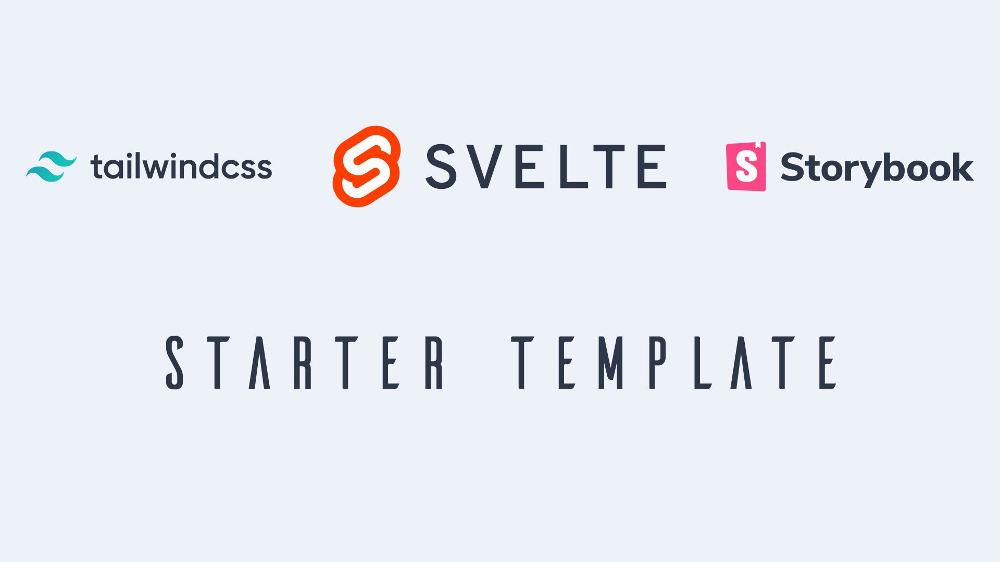

# Svelte + Storybook + Tailwind Starter Pack



[Storybook](https://storybook.js.org/) is an open source tool for developing JavaScript UI
components in isolation

[Svelte](https://svelte.dev/) is a component framework that allows you to write highly-efficient,
imperative code, that surgically updates the DOM to maintain performance.

[TailwindCSS](https://tailwindcss.com) is a highly customizable, low-level CSS framework that gives
you all of the building blocks you need to build bespoke designs without any annoying opinionated
styles you have to fight to override.

## Steps to build

1. Clone this repo `git clone https://github.com/jerriclynsjohn/svelete-storybook-tailwind.git`
2. Go to the directory `cd svelete-storybook-tailwind`
3. Install dependencies `yarn`
4. To develop your Svelete App: `yarn dev`
5. To develop UI components independant of your app: `yarn stories`

## Steps to build it all by yourself and some tips

### Instantiate Svelte App

1. Start the template file using `npx degit sveltejs/template svelete-storybook-tailwind`
2. Go to the directory `cd svelete-storybook-tailwind`
3. Install dependencies `yarn`
4. Try run the svelete app `yarn dev`

### Add Tailwind into the project

1. Install dependencies:
   `yarn add -D tailwindcss @fullhuman/postcss-purgecss autoprefixer postcss postcss-cli postcss-import svelte-preprocess`
2. Change the rollup config as shown:

```javascript
import svelte from 'rollup-plugin-svelte';
import resolve from 'rollup-plugin-node-resolve';
import commonjs from 'rollup-plugin-commonjs';
import livereload from 'rollup-plugin-livereload';
import { terser } from 'rollup-plugin-terser';
import postcss from 'rollup-plugin-postcss';
import autoPreprocess from 'svelte-preprocess';

const production = !process.env.ROLLUP_WATCH;

export default {
    input: 'src/main.js',
    output: {
        sourcemap: true,
        format: 'iife',
        name: 'app',
        file: 'public/bundle.js',
    },
    plugins: [
        svelte({
            preprocess: autoPreprocess({
                postcss: true,
            }),
            // enable run-time checks when not in production
            dev: !production,
            // we'll extract any component CSS out into
            // a separate file — better for performance
            css: css => {
                css.write('public/bundle.css');
            },
        }),
        postcss({
            extract: 'public/utils.css',
        }),

        // If you have external dependencies installed from
        // npm, you'll most likely need these plugins. In
        // some cases you'll need additional configuration —
        // consult the documentation for details:
        // https://github.com/rollup/rollup-plugin-commonjs
        resolve({
            browser: true,
            dedupe: importee => importee === 'svelte' || importee.startsWith('svelte/'),
        }),
        commonjs(),

        // Watch the `public` directory and refresh the
        // browser on changes when not in production
        !production && livereload('public'),

        // If we're building for production (npm run build
        // instead of npm run dev), minify
        production && terser(),
    ],
    watch: {
        clearScreen: false,
    },
};
```

3. Add tailwind config using the command `npx tailwind init`

4. Add PostCSS config `./postcss.config.js` as follows:

```javascript
const production = !process.env.ROLLUP_WATCH;
const purgecss = require('@fullhuman/postcss-purgecss');

module.exports = {
    plugins: [
        require('postcss-import')(),
        require('tailwindcss'),
        require('autoprefixer'),
        production &&
            purgecss({
                content: ['./**/*.html', './**/*.svelte'],
                defaultExtractor: content => {
                    const regExp = new RegExp(/[A-Za-z0-9-_:/]+/g);

                    const matchedTokens = [];

                    let match = regExp.exec(content);
                    // To make sure that you do not lose any tailwind classes used in class directive.
                    // https://github.com/tailwindcss/discuss/issues/254#issuecomment-517918397
                    while (match) {
                        if (match[0].startsWith('class:')) {
                            matchedTokens.push(match[0].substring(6));
                        } else {
                            matchedTokens.push(match[0]);
                        }

                        match = regExp.exec(content);
                    }

                    return matchedTokens;
                },
            }),
    ],
};
```

5. Build the project with some TailwindCSS utilities `yarn dev`

### Add Storybook into the Svelete Project

1. Add Storybook dependencies `yarn add -D @storybook/svelte`
2. Add tailwind configs in the `webpack.config.js` under `.storybook`:

```javascript
const path = require('path');

module.exports = ({ config, mode }) => {
    config.module.rules.push({
        test: /\.css$/,
        loaders: [
            {
                loader: 'postcss-loader',
                options: {
                    sourceMap: true,
                    config: {
                        path: './.storybook/',
                    },
                },
            },
        ],

        include: path.resolve(__dirname, '../storybook/'),
    });

    return config;
};
```

3. Create the `postcss.config.js` under `.storybook`:

```javascript
var tailwindcss = require('tailwindcss');

module.exports = {
    plugins: [
        require('postcss-import')(),
        tailwindcss('./tailwind.config.js'),
        require('autoprefixer'),
    ],
};
```

4. Add a utils.css file under `storybook/css/` and make sure you `import 'utils.css'` in your
   `stories.js` files:

```css
/* Import Tailwind as Global Utils */

@import 'tailwindcss/base';

@import 'tailwindcss/components';

@import 'tailwindcss/utilities';
```

5. Add 5 commonly used Storybook [Addons](https://storybook.js.org/addons/):
    - [Source](https://github.com/storybookjs/storybook/tree/master/addons/storysource):
      `yarn add -D @storybook/addon-storysource`
    - [Actions](https://github.com/storybookjs/storybook/tree/master/addons/actions):
      `yarn add -D @storybook/addon-actions`
    - [Notes](https://github.com/storybookjs/storybook/tree/master/addons/notes):
      `yarn add -D @storybook/addon-notes`
    - [Viewport](https://github.com/storybookjs/storybook/tree/master/addons/viewport):
      `yarn add -D @storybook/addon-viewport`
    - [Accessibility](https://github.com/storybookjs/storybook/tree/master/addons/a11y):
      `yarn add @storybook/addon-a11y --dev`
6. Make sure you have babel and svelete-loader dependencies
   `yarn add -D babel-loader @babel/core svelte-loader`
7. Add npm script in your `package.json`

```bash
{
    "scripts": {
        // Rest of the scripts
        "stories": "start-storybook",
        "build-stories": "build-storybook"
    }
}
```

8. Create a config file at the root `.storybook/config.js` with the following content:

```javascript
import { configure, addParameters, addDecorator } from '@storybook/svelte';
import { withA11y } from '@storybook/addon-a11y';

// automatically import all files ending in *.stories.js
const req = require.context('../storybook/stories', true, /\.stories\.js$/);
function loadStories() {
    req.keys().forEach(filename => req(filename));
}

configure(loadStories, module);
addDecorator(withA11y);
addParameters({ viewport: { viewports: newViewports } });
```

9. Create an addon file at the root `.storybook/addons.js` with the following content and keep
   adding additional addons in this file.

```javascript
import '@storybook/addon-storysource/register';
import '@storybook/addon-actions/register';
import '@storybook/addon-notes/register';
import '@storybook/addon-viewport/register';
import '@storybook/addon-a11y/register';
```

10. Add changes to the `webpack.config.js` to accomodate for Source addon:

```javascript
const path = require('path');

module.exports = ({ config, mode }) => {
    config.module.rules.push(
        {
            test: /\.css$/,
            loaders: [
                {
                    loader: 'postcss-loader',
                    options: {
                        sourceMap: true,
                        config: {
                            path: './.storybook/',
                        },
                    },
                },
            ],

            include: path.resolve(__dirname, '../storybook/'),
        },
        //This is the new block for the addon
        {
            test: /\.stories\.js?$/,
            loaders: [require.resolve('@storybook/addon-storysource/loader')],
            include: [path.resolve(__dirname, '../storybook')],
            enforce: 'pre',
        },
    );

    return config;
};
```

8. Write your Svelte component in `storybook\components` and yes you can use your regular `.svelte`
   file. The only thing is that you cant use templates in a story yet, not supported, but yes you
   can compose other components together. For the starter pack lets just create a clickable button.

```html
<script>
    export let text = '';
</script>

<button class="bg-blue-500 hover:bg-blue-700 text-white font-bold py-2 px-4 rounded">
    {text}
</button>
```

9. Write your stories in `storybook/stories` and you can name any number of story file with
   `<anything>.stories.js`, for the starter package we can create stories of `Button` with the
   readme notes at `<anything>.stories.md`. Note: reference the css here to make sure that tailwind
   is called by postcss:

```javascript
import '../../css/utils.css';

import { storiesOf } from '@storybook/svelte';
import ButtonSimple from '../../components/buttons/button-simple.svelte';
import markdownNotes from './buttons.stories.md';

storiesOf('Buttons | Buttons', module)
    //Traditional Alert
    .add(
        'Simple',
        () => ({
            Component: ButtonSimple,
            props: { text: 'Button' },
        }),
        { notes: { markdown: markdownNotes } },
    );
```

10. Run your storyboard `yarn stories`
