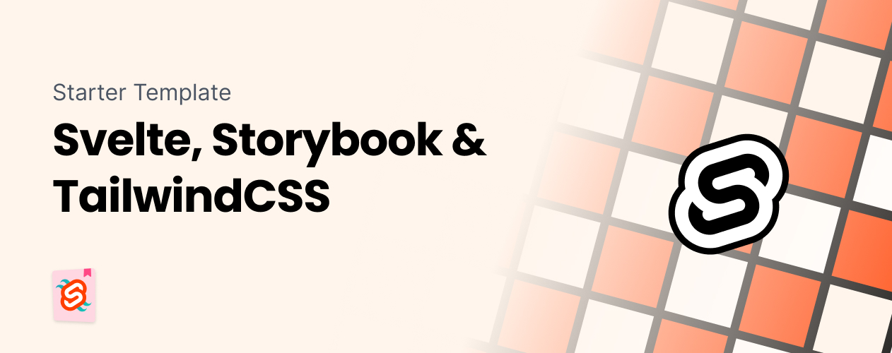

[](https://app.netlify.com/sites/svelte-tailwindcss-storybook/deploys)
# Svelte 3.5 + Storybook 7 + TailwindCSS 3



Visit the website to see the outcome: [Svelte + Storybook + TailwindCSS](https://sst.sveltehub.dev)

```bash
// Quickstart

npx degit jerriclynsjohn/svelte-storybook-tailwind my-svelte-project
cd my-svelte-project

npm
npm run dev
npm run storybook
```

This has improved a lot since I started this repo, but I feel that there is still a need to just clone the repo and kickstart the project, so here I am again updating this and I'll keep this repo updated. I also feel that there is a need for a repo which shows some best practices.

> You can easily start your project with this template, instead of wasting time figuring out configurations for each integration.

[Storybook](https://storybook.js.org/) is an open source tool for developing JavaScript UI components in isolation

[Svelte](https://svelte.dev/) is a component framework that allows you to write highly-efficient, imperative code, that surgically updates the DOM to maintain performance.

[TailwindCSS](https://tailwindcss.com/) is a highly customizable, low-level CSS framework that gives you all of the building blocks you need to build bespoke designs without any annoying opinionated styles you have to fight to override.

## Steps to build

#### Instantiate Svelte + Vite app

-   Initiate the project using `npm create vite@latest`
-   Select Svelte + Javascript from the CLI
-   You have a basic Svelte + Vite app ready

#### Add Tailwind to the project

-   Install dependencies `npm install -D tailwindcss postcss autoprefixer`
-   Instantiate the tailwind and postcss config files using `npx tailwindcss init -p`
-   Update the tailwind config as shown below to accomodate for Svelte components

```js
/** @type {import('tailwindcss').Config} */
module.exports = {
    content: ['./index.html', './src/**/*.{svelte,js,ts}'],
    theme: {
        extend: {}
    },
    plugins: []
};
``;
```

-   Add Tailwind directive to your CSS at `./src/index.css`

```css
@tailwind base;
@tailwind components;
@tailwind utilities;
```

-   Import CSS into `./src/main.js`

```js
import './index.css';
import App from './App.svelte';

const app = new App({
    target: document.getElementById('app')
});

export default app;
```

-   With this we have tailwind setup in the project

#### Add storybook and native story format into the project

-   Instantiate by running `npx storybook@next init`
-   Hook up TailwindCSS by importing the CSS into `./.storybook/preview.js`

```js
import '../src/index.css';

export const parameters = {
    backgrounds: {
        default: 'light'
    },
    actions: {argTypesRegex: '^on[A-Z].*'},
    controls: {
        matchers: {
            color: /(background|color)$/i,
            date: /Date$/
        }
    }
};
```

-   This completes the setup required for the project

### Best Practices for UI Component Library

-   Watchout for this space for more, will be updatin with some good best practises till then do feel free to explore the example UI components used for this website.
