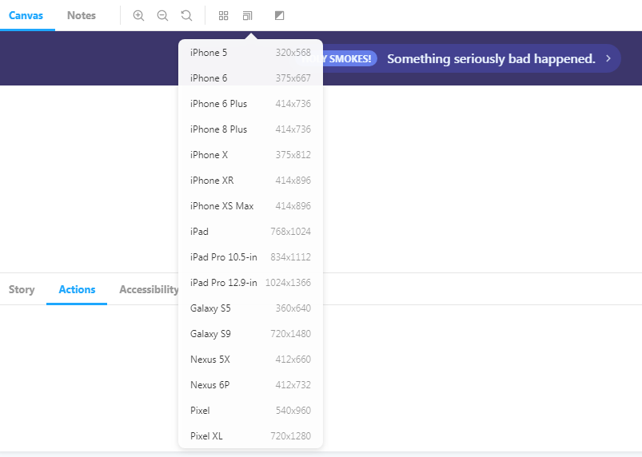

[](https://app.netlify.com/sites/svelte-tailwindcss-storybook/deploys) [](https://app.fossa.io/projects/git%2Bgithub.com%2Fjerriclynsjohn%2Fsvelte-storybook-tailwind?ref=badge_shield)

# A starter template for Svelte 3.46, TailwindCSS 3 and Storybook 6.4


> Visit this website to see the outcome: [Svelte + TailwindCSS + Storybook](https://svelte-tailwindcss-storybook.netlify.com)

```bash
// Quickstart

npx degit jerriclynsjohn/svelte-storybook-tailwind my-svelte-project
cd my-svelte-project

yarn
yarn dev
yarn storybook
```

Svelte and TailwindCSS is an awesome combination for Frontend development, but sometimes the setup seems a bit non intuitive, especially when trying to try out this awesome combination. When integrating Storybook, which is another awesome tool for UI Component development and documentation, there is no obvious place to get how it's done. This repo was made to address just that!

> You can easily start your project with this template, instead of wasting time figuring out configurations for each integration.

> Whatever you read below this is outdated. All examples needs to be updated to tailwind and screenshots needs to be updated.

## What do you get in this repo


1. A fully functional Svelte + TailwindCSS integration with side-by-side implementation of independent Storybook
2. Storybook with the most essential Addons
3. Storybook populated with basic examples of Svelte + TailwindCSS

### Addons

-   Accessibility Addon


-   Accessibility Addon - Colorblindness Emulation


-   Actions Addon


-   Notes Addon


-   Source Addon


-   Viewport Addon



## Svelte + TailwindCSS + Storybook

[Storybook](https://storybook.js.org/) is an open source tool for developing JavaScript UI
components in isolation

[Svelte](https://svelte.dev/) is a component framework that allows you to write highly-efficient,
imperative code, that surgically updates the DOM to maintain performance.

[TailwindCSS](https://tailwindcss.com) is a highly customizable, low-level CSS framework that gives
you all of the building blocks you need to build bespoke designs without any annoying opinionated
styles you have to fight to override.

## Steps to build

1. Clone this repo `git clone https://github.com/jerriclynsjohn/svelte-storybook-tailwind.git`
2. Go to the directory `cd svelte-storybook-tailwind`
3. Install dependencies `yarn`
4. To develop your Svelte App: `yarn dev`
5. To develop UI components independent of your app: `yarn stories`

### Documentations

1. Svelte - [API](https://svelte.dev/docs) and [Tutorial](https://svelte.dev/tutorial/)
2. TailwindCSS - [Docs](https://tailwindcss.com/docs) and [Tutorial](https://tailwindcss.com/screencasts/)
3. Storybook - [Docs](https://storybook.js.org/docs/basics/introduction/) and [Tutorial](https://www.learnstorybook.com/intro-to-storybook/svelte/en/get-started/)

## Steps to build it all by yourself and some tips [Warning: It's lengthy]

### Instantiate Svelte App

-   Start the template file using `npx degit sveltejs/template svelte-storybook-tailwind`
-   Go to the directory `cd svelte-storybook-tailwind`
-   Install dependencies `yarn`
-   Try run the svelte app `yarn dev`

### Add Tailwind into the project

-   Install dependencies:
    `yarn add -D tailwindcss @fullhuman/postcss-purgecss autoprefixer postcss postcss-import svelte-preprocess`
-   Change the rollup config as shown:

```javascript
import svelte from 'rollup-plugin-svelte';
import resolve from 'rollup-plugin-node-resolve';
import commonjs from 'rollup-plugin-commonjs';
import livereload from 'rollup-plugin-livereload';
import {terser} from 'rollup-plugin-terser';
import postcss from 'rollup-plugin-postcss';
import autoPreprocess from 'svelte-preprocess';

const production = !process.env.ROLLUP_WATCH;

export default {
    input: 'src/main.js',
    output: {
        sourcemap: true,
        format: 'iife',
        name: 'app',
        file: 'public/bundle.js'
    },
    plugins: [
        svelte({
            preprocess: autoPreprocess({
                postcss: true
            }),
            // enable run-time checks when not in production
            dev: !production,
            // we'll extract any component CSS out into
            // a separate file — better for performance
            css: css => {
                css.write('public/bundle.css');
            }
        }),
        postcss({
            extract: 'public/utils.css'
        }),

        // If you have external dependencies installed from
        // npm, you'll most likely need these plugins. In
        // some cases you'll need additional configuration —
        // consult the documentation for details:
        // https://github.com/rollup/rollup-plugin-commonjs
        resolve({
            browser: true,
            dedupe: importee =>
                importee === 'svelte' || importee.startsWith('svelte/')
        }),
        commonjs(),

        // Watch the `public` directory and refresh the
        // browser on changes when not in production
        !production && livereload('public'),

        // If we're building for production (npm run build
        // instead of npm run dev), minify
        production && terser()
    ],
    watch: {
        clearScreen: false
    }
};
```

-   Add tailwind config using the command `npx tailwind init`

-   Add PostCSS config `./postcss.config.js` as follows:

```javascript
const production = !process.env.ROLLUP_WATCH;
const purgecss = require('@fullhuman/postcss-purgecss');

module.exports = {
    plugins: [
        require('postcss-import')(),
        require('tailwindcss'),
        require('autoprefixer'),
        production &&
            purgecss({
                content: ['./**/*.html', './**/*.svelte'],
                defaultExtractor: content => {
                    const regExp = new RegExp(/[A-Za-z0-9-_:/]+/g);

                    const matchedTokens = [];

                    let match = regExp.exec(content);
                    // To make sure that you do not lose any tailwind classes used in class directive.
                    // https://github.com/tailwindcss/discuss/issues/254#issuecomment-517918397
                    while (match) {
                        if (match[0].startsWith('class:')) {
                            matchedTokens.push(match[0].substring(6));
                        } else {
                            matchedTokens.push(match[0]);
                        }

                        match = regExp.exec(content);
                    }

                    return matchedTokens;
                }
            })
    ]
};
```

-   Build the project with some TailwindCSS utilities `yarn dev`

### Add Storybook into the Svelte Project

-   Add Storybook dependencies `yarn add -D @storybook/svelte`
-   Add 5 commonly used Storybook [Addons](https://storybook.js.org/addons/):

    -   [Source](https://github.com/storybookjs/storybook/tree/master/addons/storysource):
        `yarn add -D @storybook/addon-storysource`
    -   [Actions](https://github.com/storybookjs/storybook/tree/master/addons/actions):
        `yarn add -D @storybook/addon-actions`
    -   [Notes](https://github.com/storybookjs/storybook/tree/master/addons/notes):
        `yarn add -D @storybook/addon-notes`
    -   [Viewport](https://github.com/storybookjs/storybook/tree/master/addons/viewport):
        `yarn add -D @storybook/addon-viewport`
    -   [Accessibility](https://github.com/storybookjs/storybook/tree/master/addons/a11y):
        `yarn add @storybook/addon-a11y --dev`

-   Create an addon file at the root `.storybook/addons.js` with the following content and keep
    adding additional addons in this file.

```javascript
import '@storybook/addon-storysource/register';
import '@storybook/addon-actions/register';
import '@storybook/addon-notes/register';
import '@storybook/addon-viewport/register';
import '@storybook/addon-a11y/register';
```

-   Create a config file at the root `.storybook/config.js` with the following content:

```javascript
import {configure, addParameters, addDecorator} from '@storybook/svelte';
import {withA11y} from '@storybook/addon-a11y';

// automatically import all files ending in *.stories.js
const req = require.context('../storybook/stories', true, /\.stories\.js$/);
function loadStories() {
    req.keys().forEach(filename => req(filename));
}

configure(loadStories, module);
addDecorator(withA11y);
addParameters({viewport: {viewports: newViewports}});
```

-   Add tailwind configs in the `webpack.config.js` under `.storybook` and also accommodate for Source addon:

```javascript
const path = require('path');

module.exports = ({config, mode}) => {
    config.module.rules.push(
        {
            test: /\.css$/,
            loaders: [
                {
                    loader: 'postcss-loader',
                    options: {
                        sourceMap: true,
                        config: {
                            path: './.storybook/'
                        }
                    }
                }
            ],

            include: path.resolve(__dirname, '../storybook/')
        },
        //This is the new block for the addon
        {
            test: /\.stories\.js?$/,
            loaders: [require.resolve('@storybook/addon-storysource/loader')],
            include: [path.resolve(__dirname, '../storybook')],
            enforce: 'pre'
        }
    );

    return config;
};
```

-   Create the `postcss.config.js` under `.storybook`:

```javascript
var tailwindcss = require('tailwindcss');

module.exports = {
    plugins: [
        require('postcss-import')(),
        tailwindcss('./tailwind.config.js'),
        require('autoprefixer')
    ]
};
```

-   Make sure you have babel and svelte-loader dependencies
    `yarn add -D babel-loader @babel/core svelte-loader`
-   Add npm script in your `package.json`

```bash
{
    "scripts": {
        // Rest of the scripts
        "stories": "start-storybook",
        "build-stories": "build-storybook"
    }
}
```

-   Add a utils.css file under `storybook/css/` and make sure you `import 'utils.css'` in your
    `stories.js` files:

```css
/* Import Tailwind as Global Utils */

@import 'tailwindcss/base';

@import 'tailwindcss/components';

@import 'tailwindcss/utilities';
```

-   Write your Svelte component in `storybook\components` and yes you can use your regular `.svelte`
    file. The only thing is that you cant use templates in a story yet, not supported, but yes you
    can compose other components together. For the starter pack lets just create a clickable button.

```html
<script>
    import {createEventDispatcher} from 'svelte';
    export let text = '';
    const dispatch = createEventDispatcher();
    function onClick(event) {
        dispatch('click', event);
    }
</script>

<button
    class="px-4 py-2 font-bold text-white bg-blue-500 rounded hover:bg-blue-700"
    on:click="{onClick}"
>
    {text}
</button>
```

-   Write your stories in `storybook/stories` and you can name any number of story file with
    `<anything>.stories.js`, for the starter package we can create stories of `Button` with the
    readme notes at `<anything>.stories.md`. Note: reference the css here to make sure that tailwind
    is called by postcss:

```javascript
import '../../css/utils.css';

import {storiesOf} from '@storybook/svelte';
import ButtonSimple from '../../components/buttons/button-simple.svelte';
import markdownNotes from './buttons.stories.md';

storiesOf('Buttons | Buttons', module)
    //Simple Button
    .add(
        'Simple',
        () => ({
            Component: ButtonSimple,
            props: {text: 'Button'},
            on: {
                click: action('I am logging in the actions tab too')
            }
        }),
        {notes: {markdown: markdownNotes}}
    );
```

-   Write your own Documentation for the Component which will `<anything>.stories.md` :

```md
# Buttons

_Examples of building buttons with Tailwind CSS._

---

Tailwind doesn't include pre-designed button styles out of the box, but they're easy to build using
existing utilities.

Here are a few examples to help you get an idea of how to build components like this using Tailwind.
```

-   Run your storyboard `yarn stories` and you'll see this:


You can add more addons and play around with them.

That's a wrap!

## License

[](https://app.fossa.io/projects/git%2Bgithub.com%2Fjerriclynsjohn%2Fsvelte-storybook-tailwind?ref=badge_large)
